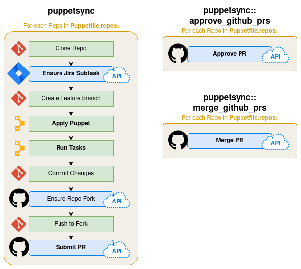

# puppetsync

<!-- vim-markdown-toc GFM -->

* [Description](#description)
* [Setup](#setup)
  * [Requirements](#requirements)
  * [Getting started](#getting-started)
  * [Quickstart](#quickstart)
    * [Sync + PR changes across all repos](#sync--pr-changes-across-all-repos)
    * [Approve PRs for every repo in Puppetfile.repos](#approve-prs-for-every-repo-in-puppetfilerepos)
    * [Merge PR every repo in Puppetfile.repos](#merge-pr-every-repo-in-puppetfilerepos)
* [Usage](#usage)
  * [Syncing repos](#syncing-repos)
* [Reference](#reference)
  * [Environment variables](#environment-variables)
  * [`puppetsync_planconfig.yaml`](#puppetsync_planconfigyaml)
  * [Plans](#plans)
    * [`puppetsync`](#puppetsync)
    * [`puppetsync::approve_github_prs`](#puppetsyncapprove_github_prs)
    * [`puppetsync::merge_github_prs`](#puppetsyncmerge_github_prs)
* [Limitations](#limitations)

<!-- vim-markdown-toc -->

## Description

**puppetsync** uses [Puppet Bolt][bolt] Plans to manage your code like
infrastructure-as-code!

* Applies Puppet manifests to enforce a common "baseline" across a large
  collection of GitHub repos
* Submits a GitHub PR to each upstream repo from a forked repo (creating the
  fork, if needed)
* Ensures there a Jira subtask documents the updates for each repo
* Approves all GitHub PRs for a specific puppetsync session
* Merges all GitHub PRs for a specific puppetsync session




## Setup

### Requirements

* [Puppet Bolt 2.x][bolt]
  * **Note:** Run puppetsync using the OS-packaged `bolt` executable (not a
    binstub from the RubyGem).
* Runtime dependencies (installed by `./Rakefile install`)
  * Puppet modules (defined in bolt project's `Puppetfile`):
  * Ruby Gems (defined in `gem.deps.rb`): octokit, jira-ruby, etc
* API authentication tokens for Jira and GitHub (set in [env
  variables](#environment-variables))
  * Some specific [environment variables](#environment-variables) are required
    for JIRA and GitHub API authentication, and to help bolt tasks find the
    Ruby Gems
* The `git` command must be available
  * SSH + ssh-agent must be set up to push changes

### Getting started

1. Use `bolt` to download the project's dependencies from `Puppetfile` and
   `gems.deps.rb`:

         /opt/puppetlabs/bolt/bin/gem install --user-install -g gem.deps.rb
         /opt/puppetlabs/bin/bolt puppetfile install

   The Rakefile can be used as a shortcut:

        ./Rakefile install

2. Add `mod` entries for the repos you want to sync in `Puppetfile.repos`
3. Customize the [`puppetsync_planconfig.yaml`](#puppetsync_planconfigyaml)
   file to your workflow
4. Set [environment variables](#environment-variables) for JIRA and GitHub API
   authentication
5. Run the plan you want

### Quickstart

Before running any commands, from the top level of this repository:

```sh
# Setting up dependencies
command -v rvm && rvm use system    # make sure you're using the packaged `bolt`
./Rakefile install                  # Install Puppet module and Ruby Gem deps
bolt plan show --filter puppetsync  # Validate bolt is working
```

#### Sync + PR changes across all repos

```sh
# (PROTIP: don't actually expose API tokens when running commands)

# To sync everything in Puppetfile.repos:
mkdir -p tmp
GITHUB_API_TOKEN=$GITHUB_API_TOKEN \
  JIRA_USER=$JIRA_USER \
  JIRA_API_TOKEN=$JIRA_API_TOKEN \
    bolt plan run puppetsync
```

#### Approve PRs for every repo in Puppetfile.repos

This will idempotently approve every open PR from user `github.pr_user` on
branch `jira.parent_issue` for each repo in `Puppetfile.repos`:

```sh
GITHUB_API_TOKEN=$GITHUB_API_TOKEN \
    bolt plan run puppetsync::approve_github_prs
```

#### Merge PR every repo in Puppetfile.repos

This will idempotently merge every approved PR from user `github.pr_user` on
branch `jira.parent_issue` for each repo in `Puppetfile.repos`:

```sh
GITHUB_API_TOKEN=$GITHUB_API_TOKEN \
    bolt plan run puppetsync::merge_github_prs
```

## Usage

### Syncing repos

After [setup](#setup), sync all repos by running:

        /opt/puppetlabs/bin/bolt plan run puppetsync

To see what's going on under the hood (potentially less irritating when
`apply()` appears to hang for a long time when updating a lot of repos):

        /opt/puppetlabs/bin/bolt plan run puppetsync --debug


To list all pipeline stages in a plan, run:

        /opt/puppetlabs/bolt/bin/bolt plan run puppetsync options='{"list_pipeline_stages": true}'


## Reference

### Environment variables

To create Jira subtasks, these environment variables are necessary:

| Env variable | Purpose   |                           |
| ------------ | -------   | ------------------------- |
| `JIRA_USER`  | Jira user | Probably an email address |
| `JIRA_API_TOKEN` | Jira API token | You MUST generate an API token (basic auth no longer works). To do so, you must have Jira instance access rights.  You can generate a token here: https://id.atlassian.com/manage/api-tokens |

To fork GitHub repositories and submit Pull Requests, these environment variables are necessary:

| Env variable       | Purpose          |     |
| ------------       | -------          | --- |
| `GITHUB_API_TOKEN` | GitHub API token |     |

(Recommended) To prevent bolt from collecting analytics, set this environment variable:

| Env variable                  | Purpose                                                                           |     |
| ------------                  | -------                                                                           | --- |
| `BOLT_DISABLE_ANALYTICS=true` | Prevent bolt's analytics from phoning home to tell Puppet about everything you do |     |

### `puppetsync_planconfig.yaml`

Example:

```yaml
---
puppetsync:
  puppet_role: 'role::pupmod_travis_only'
  permitted_project_types:
    - pupmod

jira:
  parent_issue: SIMP-7035
  project: SIMP
  jira_site: https://simp-project.atlassian.net
  subtask_title: 'Update .travis.yml pipeline in %COMPONENT%'

  # optional subtask fields:
  subtask_story_points: 1
  subtask_assignee: 'chris.tessmer'

git:
  commit_message: |
    (%JIRA_PARENT_ISSUE%) Update to new Travis CI pipeline

    This patch updates the Travis Pipeline to a static, standardized format
    that uses project variables for secrets. It includes an optional
    diagnostic mode to test the project's variables against their respective
    deployment APIs (GitHub and Puppet Forge).

    [%JIRA_PARENT_ISSUE%] #comment Update to latest pipeline in %COMPONENT%
    [%JIRA_SUBTASK%] #close

github:
  pr_user: op-ct
  approval_message: ':+1: lgtm'
```

### Plans

#### `puppetsync`

The main plan (`puppetsync`) executes the workflow as series of pipeline
of stages for each repo. It will:

1. Clone `:git` repositories defined in a `Puppetfile.repos` file

Then―for each repository (in parallel)―it will:

2. Ensure a Jira subtask exists to track the change
3. Check out a new git feature branch
4. Apply Puppet manifests to enforce a common repository asset baseline
5. Commit changes to git with a templated commit message
6. Ensure the user has forked repository on GitHub
7. Push changes up to the user's forked repository
8. Submit a Pull Request to merge the changes back the original repository and branch

If an individual repo encounters failures during a stage, it will be held back
while the other repos proceed with their workflows.

All failures are summarized after the full plan finishes executing.

#### `puppetsync::approve_github_prs`

#### `puppetsync::merge_github_prs`

## Limitations

* Requires git to be configured with SSH, with keys loaded into a running agent
* Probably only works from an \*nix host

[bolt]: https://puppet.com/docs/bolt/latest/bolt.html
